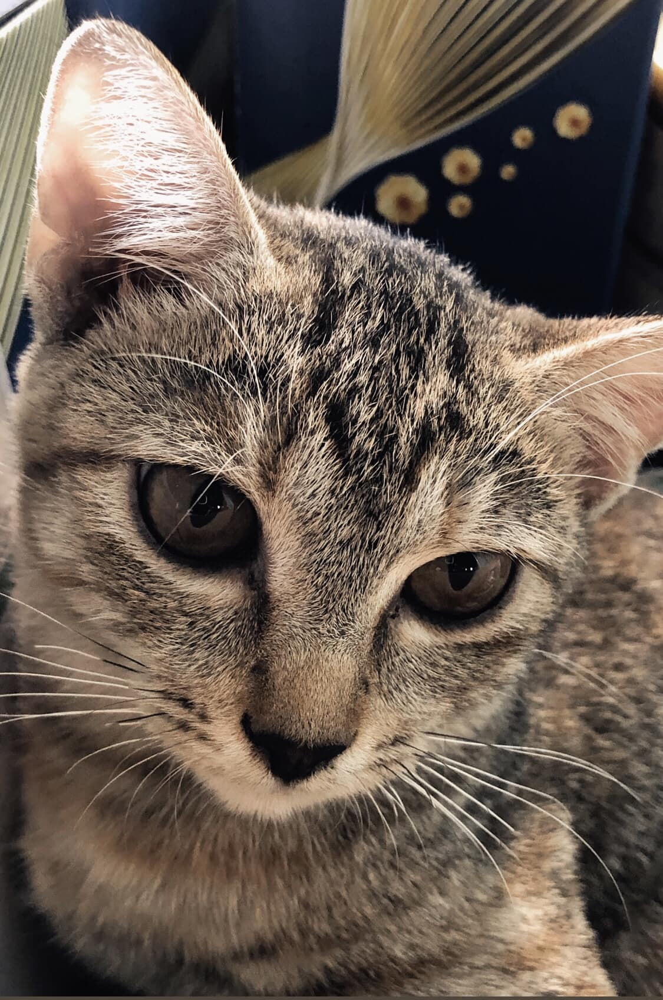

# CatKat.github.io
<!DOCTYPE html>
<html lang="en">
<head>
    <meta charset="UTF-8">
    <meta name="viewport" content="width=device-width, initial-scale=1.0">
    <title>The Cat Unknown</title>
    <link rel="icon" type="image/png" href="drawCat.jpg">
</head>
<body>
    <main> 
        <h1>The University of cat</h1>
        

            <h2>About</h2>
            
A cat try to creat a page for human read

        

        

            <h3>Quick speed run web</h3>
                <ol>
                    <li>
                        
Cat feeling happy

                        <meter min = "0", max = "100", value = "80"></meter>
                    </li>
                    <li>
                        
This below come to my Facebook

                        <h2><a href = "https://www.facebook.com/vom.carino/" target="_blank">Infor</a></h2>
                    </li>
                    <li>
                        
This is the end of list

                    </li>
                </ol>
            <h2>The most thing you need to know that is:</h2>
            <ul>
                <li><strong>The cat from University of FPT</strong></li>
            </ul>
        

        
 
            <h3>My images</h3>
            
            
            
        

    </main>
</body>
</html>
